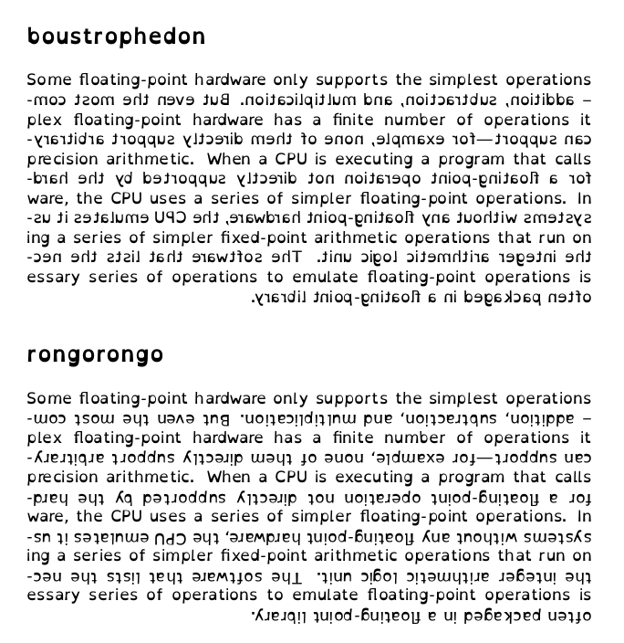

#Boustrophedon and Rongorongo text direction for LaTeX

Typesetting for the boustrophedon and rongorongo text-directions of Safaic, Sabean and some ancient Greek writing systems as well as reverse-boustrophedonic text as seen in Rongorongo (Easter Island). Boustrophedon and rongorongo do not require flicking the eye across the page after each line so I'm thinking boustrophedon would be good for speed reading and people who sometimes lose their line (such as myself). I personally find doubly-ragged-justified rongorongo to be ideal.

A recommended font for this is [OpenDyslexic](http://opendyslexic.org/) because it's designed to be easy for the reader to know which direction the text is moving.

##TODO

* Handle text wrap.
* Handle different justifications such as ragged-right, doubly-ragged etc.
* Do our kind of hyphenation.
* Possibly augment the [BiDiTeX](http://biditex.berlios.de/) package instead.

##External Links

http://www.ntg.nl/pipermail/aleph/2004-March/000094.html

http://en.wikipedia.org/wiki/Boustrophedon
